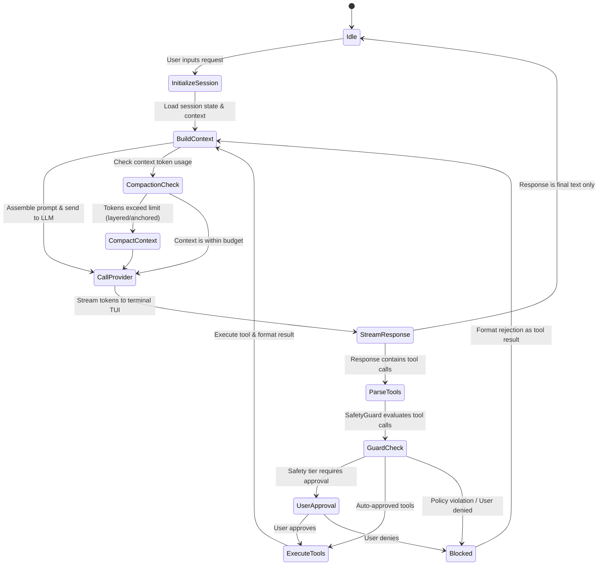

# ASH — Architectural Specification

This document provides the concrete architectural specification for the Ash coding harness. It defines core loop states, module interfaces, database schemas, and data flow patterns. This file is designed as a direct reference for AI agents building Ash.

---

## 1. The Core Agent Loop Flow

The Ash agent operates on a continuous event loop, processing user requests, invoking the LLM, parsing responses, validating tool safety, executing tools, and formatting results.



### Loop State Descriptions
1. **Idle**: Waiting for user terminal input.
2. **InitializeSession**: Bootstraps or restores the active session ID, loads configuration.
3. **BuildContext**: Runs the `ContextBuilder` to fetch active files, repository map, short-term memory, and formats the prompt.
4. **CallProvider**: Initiates the streaming request to the configured LLM provider.
5. **StreamResponse**: Renders output via `StreamHandler` in real-time, buffering tool calls.
6. **ParseTools**: Detects XML tags or tool call structures in the stream.
7. **GuardCheck**: Dispatches tool signatures to `SafetyGuard` to verify path containment, command blocklist, and safety tiering.
8. **UserApproval**: Halts execution, presents differences or actions to the user, and waits for keyboard input.
9. **ExecuteTools**: Runs tools concurrently (where independent) using `asyncio.gather`.
10. **Blocked**: Formats safety violations or user rejections as standard tool output messages to feed back into the model.
11. **CompactionCheck**: Compares total context size against limits, triggering compaction if necessary.

---

## 2. Module Contracts & Method Signatures

All classes must follow standard Python 3.12+ type hinting.

### 2.1 Core Loop (`ash/core/loop.py`)

The orchestrator of the state machine.

```python
from typing import Any
from pathlib import Path
from ash.core.recovery import CircuitBreaker
from ash.core.session import Message, Session, SessionStore, ToolCallRecord
from ash.providers.base import ProviderABC, TokenCounterLike
from ash.repo.repomap import RepoMap
from ash.safety.guard import SafetyGuard
from ash.tools.base import BaseTool, ToolResult
from ash.ui.terminal import TerminalUI

class AshLoop:
    def __init__(
        self,
        session_store: SessionStore,
        provider: ProviderABC,
        safety_guard: SafetyGuard,
        ui: TerminalUI,
        project_root: Path,
        *,
        tools: dict[str, BaseTool] | None = None,
        circuit_breaker: CircuitBreaker | None = None,
        system_prompt: str | None = None,
        token_counter: TokenCounterLike | None = None,
        max_turn_iterations: int = DEFAULT_MAX_TURN_ITERATIONS,
        repo_map: RepoMap | None = None,
        auto_commit: bool = False,
        auto_commit_paths: list[Path] | None = None,
        planner: "Planner | None" = None,
        enable_sprint_planning: bool = False,
    ) -> None:
        self.session_store = session_store
        self.provider = provider
        self.safety_guard = safety_guard
        self.ui = ui
        self.project_root = project_root
        self.tools: dict[str, BaseTool] = dict(tools or {})
        self.circuit_breaker = circuit_breaker or CircuitBreaker()
        self.system_prompt = system_prompt or _default_system_prompt(project_root)
        self.token_counter = token_counter
        self.max_turn_iterations = max_turn_iterations
        self.repo_map = repo_map
        self.auto_commit = auto_commit
        self.auto_commit_paths = list(auto_commit_paths or [])
        self.planner = planner
        self.enable_sprint_planning = enable_sprint_planning
        self.current_session: Session | None = None

    async def start_session(self, session_id: str | None = None) -> Session:
        """Create a new session or restore one by id."""
        ...

    async def run_turn(self, user_input: str) -> str:
        """Run a single user turn to completion and return the final text."""
        ...

    async def execute_tool_calls(self, tool_calls: list[dict]) -> list[dict]:
        """Validates tool calls with safety guard and executes them in parallel."""
        ...
```

### 2.2 Session Persistence (`ash/core/session.py`)

Handles saving and loading the linear history of messages and tool logs.

```python
from datetime import datetime
from typing import List, Dict, Any, Optional
from pydantic import BaseModel

class Message(BaseModel):
    role: str  # "system" | "user" | "assistant" | "tool"
    content: str
    timestamp: datetime
    metadata: Dict[str, Any] = {}

class ToolCallRecord(BaseModel):
    call_id: str
    tool_name: str
    arguments: Dict[str, Any]
    approved: bool
    executed: bool
    result: Optional[str] = None
    error: Optional[str] = None
    timestamp: datetime

class Session(BaseModel):
    session_id: str
    project_path: str
    created_at: datetime
    messages: List[Message] = []
    tool_calls: List[ToolCallRecord] = []

class SessionStore:
    def __init__(self, db_path: str) -> None:
        self.db_path = db_path
        self._init_db()

    def _init_db(self) -> None:
        """Creates session tables if they do not exist."""
        ...

    def create_session(self, project_path: str) -> Session:
        """Creates a new session record in SQLite and returns the Session model."""
        ...

    def load_session(self, session_id: str) -> Session:
        """Loads a session with all its messages and tool call records."""
        ...

    def save_message(self, session_id: str, message: Message) -> None:
        """Appends a single message to the database."""
        ...

    def save_tool_call(self, session_id: str, record: ToolCallRecord) -> None:
        """Saves or updates a tool execution record."""
        ...
```

### 2.3 Context Builder (`ash/core/context.py`)

Assembles the context window for the model.

```python
from typing import List
from ash.core.session import Session, Message
from ash.memory.fts5 import FTS5Index
from ash.repo.repomap import RepoMap

class ContextBuilder:
    def __init__(
        self,
        project_root: Path,
        repo_map: RepoMap,
        fts_index: FTS5Index,
        max_context_tokens: int = 128000
    ) -> None:
        self.project_root = project_root
        self.repo_map = repo_map
        self.fts_index = fts_index
        self.max_context_tokens = max_context_tokens

    async def build(self, session: Session, active_files: List[Path]) -> List[Message]:
        """
        Assembles context in descending priority:
        1. Core System Prompt (Safety + XML schemas)
        2. Dynamic Repo Map
        3. Most recent session messages (truncated/compacted if needed)
        4. Injected contents of active_files
        5. Relevant semantic memory matches from FTS5
        """
        ...
```

### 2.4 Recovery & Circuit Breaker (`ash/core/recovery.py`)

Prevents infinite agent loops (e.g. tool fails, agent retries tool, fails again).

```python
class CircuitBreakerError(Exception):
    """Raised when a tool has failed too many times in a row."""


class CircuitBreaker:
    """Track consecutive tool failures and trip after ``max_failures``."""

    def __init__(self, max_failures: int = 3) -> None:
        if max_failures < 1:
            raise ValueError("max_failures must be at least 1")
        self.max_failures = max_failures
        self.failure_counter: int = 0
        self.last_failed_tool: str = ""
        self._is_tripped: bool = False

    def record_failure(self, tool_name: str) -> None:
        """Record a tool failure.

        Only consecutive failures of the *same* tool count toward the trip
        threshold. A different tool name (or a successful call between two
        failures of the same tool) resets the counter to 1 for the new tool.
        """

        if tool_name == self.last_failed_tool:
            self.failure_counter += 1
        else:
            self.last_failed_tool = tool_name
            self.failure_counter = 1

        if self.failure_counter >= self.max_failures:
            self._is_tripped = True

    def record_success(self) -> None:
        """Reset failure metrics after a successful tool execution."""

        self.failure_counter = 0
        self.last_failed_tool = ""

    def reset(self) -> None:
        """Explicitly clear all failure state."""

        self.failure_counter = 0
        self.last_failed_tool = ""
        self._is_tripped = False

    @property
    def is_tripped(self) -> bool:
        """Whether the breaker is at or past the trip threshold."""

        return self._is_tripped
```

The loop checks ``breaker.is_tripped`` after each tool execution. When true, it halts
the turn and surfaces a message to the user rather than raising an exception.
```

### 2.5 Provider Interface (`ash/providers/base.py`)

```python
from typing import AsyncGenerator
from abc import ABC, abstractmethod
from pydantic import BaseModel

class StreamChunk(BaseModel):
    content: str = ""
    tool_call_delta: str = ""
    is_done: bool = False
    prompt_tokens: int = 0
    completion_tokens: int = 0

class ProviderABC(ABC):
    @abstractmethod
    async def stream_chat(
        self,
        messages: list,
        temperature: float = 0.0
    ) -> AsyncGenerator[StreamChunk, None]:
        """Streams response tokens and tool call segments in real-time."""
        ...

    @abstractmethod
    def count_tokens(self, text: str) -> int:
        """Calculates token footprint exactly matching provider tokenizer rules."""
        ...
```

### 2.6 Safety Guard (`ash/safety/guard.py`)

Validates filesystem paths, command parameters, and scopes.

```python
from pathlib import Path
from typing import Dict, Any, Tuple

class SafetyViolation(Exception):
    pass

class SafetyGuard:
    def __init__(self, project_root: Path, allowed_directories: list[Path] = None) -> None:
        self.project_root = project_root.resolve()
        self.allowed_directories = allowed_directories or [self.project_root]
        self.blocklist_commands = ["format", "rm -rf /", "remove-item -recurse c:\\"]

    def validate_path(self, target_path: str) -> Path:
        """
        Ensures target path resolves inside the project root or allowed_directories.
        Throws SafetyViolation on path traversal outside scope.
        """
        resolved = Path(target_path).resolve()
        for allowed in self.allowed_directories:
            try:
                resolved.relative_to(allowed)
                return resolved  # Resolves safely inside allowed directory
            except ValueError:
                continue
        raise SafetyViolation(f"Access Denied: Path '{target_path}' is outside project scope.")

    def validate_command(self, command_str: str) -> Tuple[bool, str]:
        """
        Scans CLI commands for dangerous tokens or parameter combinations.
        Returns: (is_valid, error_reason)
        """
        ...
```

### 2.7 Configuration Settings (`ash/config.py`)

Handles loading configuration parameters dynamically from environmental variables and the `ash.toml` configuration file.

```python
from pathlib import Path
from typing import Literal
from pydantic import Field, field_validator
from pydantic_settings import BaseSettings, SettingsConfigDict

class AshConfig(BaseSettings):
    # Model configuration settings loading
    model_config = SettingsConfigDict(
        env_prefix="ASH_",
        toml_file="ash.toml",
        extra="ignore"
    )

    # Provider Configuration
    provider: Literal["anthropic", "openai", "ollama"] = Field(
        default="anthropic",
        description="Primary model provider.",
    )
    model_name: str = Field("claude-3-5-sonnet-20241022", description="Model identifier to invoke.")
    temperature: float = Field(0.0, description="Model generation temperature.")
    api_key: str = Field(..., description="API Access key.")

    # Context & Token Limits
    max_context_tokens: int = Field(128000, description="Maximum total tokens in the input context window.")
    max_completion_tokens: int = Field(4000, description="Maximum tokens generated in response completion.")
    max_tool_result_tokens: int = Field(20000, description="Limit for single tool response strings before middle truncation.")

    # Safety Configuration
    safety_tier: Literal["interactive", "auto_approve", "dry_run"] = Field(
        default="interactive",
        description="Safety enforcement mode.",
    )
    workspace_root: Path = Field(default_factory=Path.cwd, description="Scoped base folder containing project target code.")
    command_blocklist: list[str] = Field(
        default=["format", "rm -rf", "Remove-Item"],
        description="Command patterns that immediately fail SafetyGuard checks."
    )

    # Database Configuration
    db_directory: Path = Field(
        default=Path.home() / ".ash" / "db",
        description="Folder path housing local SQLite persistence files."
    )

    # Validators
    @field_validator("temperature", mode="after")
    @classmethod
    def validate_temperature(cls, value: float) -> float:
        if not 0.0 <= value <= 2.0:
            raise ValueError(f"temperature must be in [0.0, 2.0], got {value}")
        return value

    @field_validator("max_context_tokens", "max_completion_tokens", "max_tool_result_tokens", mode="after")
    @classmethod
    def validate_token_limits(cls, value: int) -> int:
        if value <= 0:
            raise ValueError(f"token limit must be positive, got {value}")
        return value

    @field_validator("api_key", mode="after")
    @classmethod
    def validate_api_key(cls, value: str) -> str:
        stripped = value.strip()
        if not stripped:
            raise ValueError("api_key must not be blank")
        placeholder_patterns = ("replace-with-your-api-key", "your-api-key-here", "sk-...")
        if any(p in stripped for p in placeholder_patterns):
            raise ValueError("api_key appears to be a placeholder...")
        return stripped
    )
```

---

## 3. SQLite Database Schema Specifications

Ash uses local SQLite databases to store history, semantic documents, and state. SQLite WAL (Write-Ahead Logging) mode must be enabled on connection initialization.

### Connection Initialization Hook
```python
import sqlite3
import asyncio
from contextlib import asynccontextmanager

# Async lock registry to serialize SQLite write transactions across async tasks
_db_write_locks: dict[str, asyncio.Lock] = {}

def get_db_connection(db_path: str) -> sqlite3.Connection:
    # Disable check_same_thread so connections can cross async executor boundaries safely
    conn = sqlite3.connect(db_path, check_same_thread=False)
    conn.row_factory = sqlite3.Row
    # Enable WAL mode for high concurrency
    conn.execute("PRAGMA journal_mode=WAL;")
    conn.execute("PRAGMA synchronous=NORMAL;")
    conn.execute("PRAGMA foreign_keys=ON;")
    return conn

@asynccontextmanager
async def write_transaction(db_path: str):
    """Asynchronous transaction context manager to coordinate safe write locking."""
    if db_path not in _db_write_locks:
        _db_write_locks[db_path] = asyncio.Lock()

    async with _db_write_locks[db_path]:
        conn = get_db_connection(db_path)
        try:
            yield conn
            conn.commit()
        except Exception as e:
            conn.rollback()
            raise e
        finally:
            conn.close()
```

### 3.1 Session Store Schema (`session_store.db`)

```sql
CREATE TABLE IF NOT EXISTS sessions (
    session_id TEXT PRIMARY KEY,
    project_path TEXT NOT NULL,
    created_at TIMESTAMP DEFAULT CURRENT_TIMESTAMP
);

CREATE TABLE IF NOT EXISTS messages (
    message_id INTEGER PRIMARY KEY AUTOINCREMENT,
    session_id TEXT NOT NULL,
    role TEXT CHECK(role IN ('system', 'user', 'assistant', 'tool')),
    content TEXT NOT NULL,
    timestamp TIMESTAMP DEFAULT CURRENT_TIMESTAMP,
    metadata_json TEXT,
    FOREIGN KEY(session_id) REFERENCES sessions(session_id) ON DELETE CASCADE
);

CREATE TABLE IF NOT EXISTS tool_calls (
    call_id TEXT PRIMARY KEY,
    session_id TEXT NOT NULL,
    tool_name TEXT NOT NULL,
    arguments_json TEXT NOT NULL,
    approved INTEGER CHECK(approved IN (0, 1)) DEFAULT 0,
    executed INTEGER CHECK(executed IN (0, 1)) DEFAULT 0,
    result TEXT,
    error TEXT,
    timestamp TIMESTAMP DEFAULT CURRENT_TIMESTAMP,
    FOREIGN KEY(session_id) REFERENCES sessions(session_id) ON DELETE CASCADE
);

CREATE INDEX IF NOT EXISTS idx_messages_session ON messages(session_id);
CREATE INDEX IF NOT EXISTS idx_tool_calls_session ON tool_calls(session_id);

-- Sprint planning tables (Sprint 12 / V5)
CREATE TABLE IF NOT EXISTS sprints (
    sprint_id TEXT PRIMARY KEY,
    session_id TEXT NOT NULL,
    goal TEXT NOT NULL,
    state TEXT NOT NULL CHECK(state IN ('planning','active','complete','aborted')),
    contract_json TEXT NOT NULL,
    created_at TIMESTAMP DEFAULT CURRENT_TIMESTAMP,
    started_at TIMESTAMP,
    completed_at TIMESTAMP,
    abort_reason TEXT DEFAULT '',
    FOREIGN KEY(session_id) REFERENCES sessions(session_id) ON DELETE CASCADE
);

CREATE TABLE IF NOT EXISTS checklist_items (
    item_id INTEGER PRIMARY KEY AUTOINCREMENT,
    sprint_id TEXT NOT NULL,
    idx INTEGER NOT NULL,
    section TEXT NOT NULL,
    description TEXT NOT NULL,
    status TEXT NOT NULL CHECK(status IN ('pending','in_progress','done','skipped','failed')),
    notes TEXT DEFAULT '',
    UNIQUE(sprint_id, idx),
    FOREIGN KEY(sprint_id) REFERENCES sprints(sprint_id) ON DELETE CASCADE
);

CREATE INDEX IF NOT EXISTS idx_sprints_session ON sprints(session_id);
CREATE INDEX IF NOT EXISTS idx_checklist_sprint ON checklist_items(sprint_id);
```

### 3.2 Semantic Index FTS5 Schema (`fts5.db`)

Provides instantaneous cross-session lexical and semantic search.

```sql
-- FTS5 Virtual Table for full-text search
CREATE VIRTUAL TABLE IF NOT EXISTS fts_index USING fts5(
    file_path,
    content,
    symbol_tags,
    tokenize="unicode61"
);

-- Metadata store mapping virtual document IDs
CREATE TABLE IF NOT EXISTS document_metadata (
    rowid INTEGER PRIMARY KEY,
    file_path TEXT NOT NULL,
    last_modified TIMESTAMP,
    sha256 TEXT UNIQUE
);
```

### 3.3 Subagent Shared State Schema (database path set at ``SharedState`` instantiation)

Used by multi-agent architectures (V6) to track background tasks and communicate safely.

```sql
PRAGMA journal_mode=WAL;
PRAGMA synchronous=NORMAL;
PRAGMA foreign_keys=ON;
PRAGMA busy_timeout=5000;

CREATE TABLE IF NOT EXISTS agent_status (
    agent_id TEXT PRIMARY KEY,
    role TEXT NOT NULL DEFAULT 'general',
    status TEXT CHECK(status IN ('idle','working','failed','completed')) NOT NULL,
    current_task TEXT NOT NULL DEFAULT '',
    last_heartbeat TIMESTAMP DEFAULT CURRENT_TIMESTAMP,
    metadata_json TEXT NOT NULL DEFAULT '{}'
);

CREATE TABLE IF NOT EXISTS ipc_messages (
    message_id INTEGER PRIMARY KEY AUTOINCREMENT,
    sender_id TEXT NOT NULL,
    recipient_id TEXT NOT NULL,
    message_type TEXT NOT NULL,
    content_json TEXT NOT NULL,
    delivered INTEGER CHECK(delivered IN (0, 1)) DEFAULT 0,
    timestamp TIMESTAMP DEFAULT CURRENT_TIMESTAMP
);

CREATE TABLE IF NOT EXISTS sprints (
    sprint_id TEXT PRIMARY KEY,
    lead_agent_id TEXT NOT NULL,
    sprint_goal TEXT NOT NULL,
    state TEXT CHECK(state IN ('planning','active','complete','aborted')) NOT NULL,
    created_at TIMESTAMP DEFAULT CURRENT_TIMESTAMP
);

CREATE INDEX IF NOT EXISTS idx_ipc_recipient ON ipc_messages(recipient_id, delivered);
CREATE INDEX IF NOT EXISTS idx_ipc_timestamp ON ipc_messages(timestamp);
```

### 3.4 Audit Trail Log Schema (`session_store.db` or dedicated database)

Ash logs all system and user operations for compliance, traceability, and review.

```sql
CREATE TABLE IF NOT EXISTS audit_logs (
    log_id INTEGER PRIMARY KEY AUTOINCREMENT,
    session_id TEXT NOT NULL,
    timestamp TIMESTAMP DEFAULT CURRENT_TIMESTAMP,
    action_type TEXT CHECK(action_type IN ('tool_call', 'command_run', 'file_write', 'safety_block', 'user_approval')),
    target_resource TEXT NOT NULL,            -- e.g. "config.py" or "cargo test"
    details_json TEXT NOT NULL,               -- Full argument variables or command parameters
    result TEXT CHECK(result IN ('APPROVED', 'DENIED', 'BLOCKED_BY_GUARD', 'SUCCESS', 'FAILURE')),
    sha256_hash TEXT                          -- SHA-256 hash of files modified (before/after states)
);

CREATE INDEX IF NOT EXISTS idx_audit_session ON audit_logs(session_id);
```

---

## 4. Sequence Diagram: Model-Tool Interaction Turn

```mermaid
sequenceDiagram
    autonumber
    actor User
    participant Loop as AshLoop
    participant Context as ContextBuilder
    participant Provider as ProviderABC
    participant Guard as SafetyGuard
    participant Tool as ToolRegistry
    participant Session as SessionStore

    User->>Loop: "Modify config.py settings"
    Loop->>Session: Load Session History
    Loop->>Context: Build Context Prompt
    Context-->>Loop: Prompt Data
    Loop->>Provider: Stream Chat
    Provider-->>Loop: Stream Token/Chunk
    Note over Loop: Chunk matches tool tags:<br/>&lt;call_tool name="write_file"&gt;
    Loop->>Guard: validate_path("config.py")
    Guard-->>Loop: Validated Path
    Loop->>Loop: Circuit Breaker Verification
    Loop->>User: Display Diff (Prompt Approval)
    User->>Loop: Approved
    Loop->>Tool: Execute write_file
    Tool-->>Loop: Success (0 bytes error)
    Loop->>Session: Save Tool Call & Result
    Loop->>Context: Rebuild Context (includes Tool Result)
    Loop->>Provider: Stream Next Response Block
    Provider-->>Loop: Text Token: "I have updated..."
    Loop->>User: Render output on Terminal UI
```
